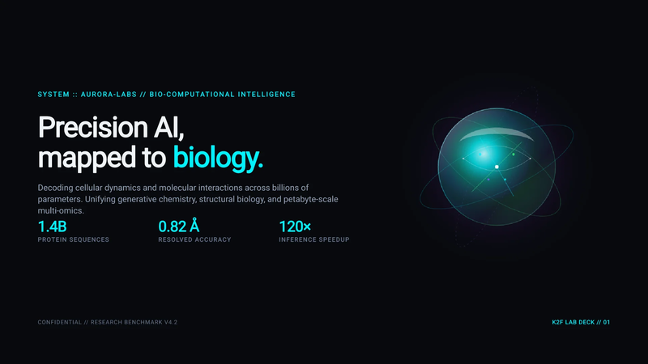
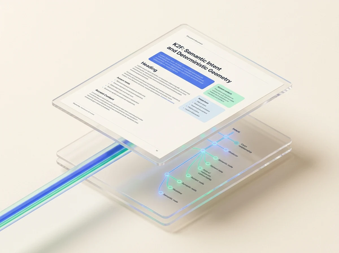
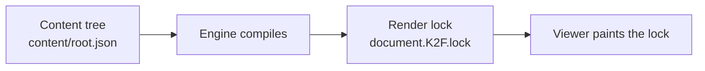

<p align="center">
  <a href="https://k2f.dev">
    
  </a>
</p>

<p align="center">
  <strong>K2F is an open document file format — like PDF or DOCX — that AI can edit, and always looks exactly the same wherever you open it.</strong>
  <br />
  Consistent like PDF. Editable like code.
</p>

<p align="center">
  <a href="https://github.com/suzheng/k2f/actions/workflows/golden-suite.yml"></a>
  <a href="https://crates.io/crates/k2f"></a>
  <a href="https://pypi.org/project/k2f/"></a>
  <a href="https://www.npmjs.com/package/@openk2f/k2f"></a>
</p>

<p align="center">
  <a href="https://k2f.dev"><b>k2f.dev</b></a> ·
  <a href="https://k2f.dev/playground">Playground</a> ·
  <a href="https://k2f.dev/gallery">Gallery</a> ·
  <a href="https://k2f.dev/docs">Docs</a> ·
  <a href="docs/spec/k2f-v0.1.md">Spec</a>
</p>

```bash
npx skills add suzheng/k2f --skill k2f
```

Works in Cursor, Claude Code, Codex, and other agents that support `npx skills`. Then say *Generate an invoice* or *Write a monthly report.*

## Contents

- [What is K2F](#what-is-k2f)
- [Why it exists](#why-it-exists)
- [How a file is put together](#how-a-file-is-put-together)
- [Use it with an agent](#use-it-with-an-agent)
- [Build with it](#build-with-it)
- [Ecosystem](#ecosystem)
- [What's in v0.1](#whats-in-v01)
- [Docs](#docs)

## What is K2F

A `.K2F` file is a document you send the way you send a PDF or a Word file. PDF looks the same on every computer because it is a drawing: put this glyph here, draw that line there. An agent cannot safely change "clause 4" or "the invoice total." Word and Markdown are easy to rewrite. The page is not locked. The same file can look different in Word and Google Docs, or on GitHub and as an exported PDF.

K2F puts the editable JSON and the compiled page in one ZIP. The words and structure live as JSON, so you or an agent can change a heading or a table cell by name. The finished page is compiled once into the same file. Fonts and images travel with it. Official readers paint that compiled page. They do not reflow the body text.

<p align="center">
  <a href="https://k2f.dev/gallery/aurora-data">
    
  </a>
  <br />
  <em>Engine output for the Aurora Data gallery template. More samples in the <a href="https://k2f.dev/gallery">Gallery</a>. Try a file in the <a href="https://k2f.dev/playground">Playground</a>.</em>
</p>

## Why it exists

For a contract or an invoice, an agent has to change named pieces (a clause, a total), and the page has to stay put when someone else opens the file. PDF locks the page. HTML and Markdown are easy to rewrite, and then the layout moves.

| PDF | HTML | K2F |
|-----|------|-----|
| Same page. Not editable as source. | Editable. Layout moves. | Edit the meaning. Ship a locked page. |

<table>
  <tr>
    <td width="50%" valign="top">
      <p align="center"><strong>PDF</strong></p>
      
      <p>PDF stores paint instructions. OCR can recover text. That is still not a source an agent can rewrite safely.</p>
    </td>
    <td width="50%" valign="top">
      <p align="center"><strong>K2F</strong></p>
      
      <p>A JSON tree you patch by id, plus a theme. A pinned engine compiles both. Official readers paint that compiled page.</p>
    </td>
  </tr>
</table>

Longer comparison, including Markdown and Office: [Why K2F](https://k2f.dev/why).

## How a file is put together

The package holds editable JSON and a compiled page. You edit the JSON. The engine lays it out once and writes a **render lock** (`document.K2F.lock`). Official viewers paint that lock. They do not lay out the body again.

Agents edit meaning; the engine decides placement.



```
document.k2f
├── manifest.json       # metadata
├── content/root.json   # what the document says
├── styles/theme.json   # how roles look
└── document.K2F.lock   # compiled page (written at compile)
```

The **content tree** (`content/root.json`) holds headings, tables, warnings, and body text. Every node has a stable dotted `id` such as `invoice.total`. Agents patch those ids. Coordinates stay out of this file.

The **theme** (`styles/theme.json`) holds appearance. A node says `role: "warning"`. Font size and color belong in the theme.

```json
{
  "id": "invoice.header",
  "role": "h1",
  "content": { "type": "text", "value": "STATEMENT #2025-001" }
}
```

```json
{
  "roles": {
    "h1": { "font_size": 24000, "bold": true, "color": "google_blue_600" }
  },
  "palette": { "google_blue_600": "#1A73E8" }
}
```

The full package also embeds fonts, schemas, and `changelog.json`. See the [format spec](docs/spec/k2f-v0.1.md) and [design goals](docs/architecture/design.md).

<details>
<summary>Longer content and theme excerpts</summary>

**Content** (`content/root.json`):

```json
{
  "id": "invoice.header",
  "role": "h1",
  "content": { "type": "text", "value": "STATEMENT #2025-001" }
},
{
  "id": "invoice.details",
  "role": "body",
  "content": { "type": "text", "value": "Date: 15 Dec 2025\nBill To: TechInnovate Inc." }
},
{
  "role": "warning",
  "content": { "type": "text", "value": "Semantics and styles are fully separated." }
}
```

**Theme** (`styles/theme.json`):

```json
{
  "roles": {
    "h1": { "font_size": 24000, "bold": true, "color": "google_blue_600" },
    "body": { "font_size": 12000, "color": "ink" }
  },
  "palette": {
    "ink": "#202124",
    "google_blue_600": "#1A73E8"
  }
}
```

</details>

## Use it with an agent

```bash
npx skills add suzheng/k2f --skill k2f
```

If `npx skills` is not available, copy [`skills/k2f/`](skills/k2f/) into your agent's skills directory (for example `~/.cursor/skills/k2f/`), or browse [skills/k2f on GitHub](https://github.com/suzheng/k2f/tree/main/skills/k2f).

Before the agent writes a file, install the published CLI:

```bash
pip install k2f              # CLI on PATH + Python SDK
# npm i @openk2f/k2f         # only when embedding <k2f-viewer>
# cargo install k2f          # optional: CLI without Python
```

Then say *Generate an invoice* or *Write a monthly report.* MCP is optional; writing does not require it.

Workflows, catalog, and scripts: [skills/README.md](skills/README.md) · [skills/k2f/SKILL.md](skills/k2f/SKILL.md).

## Build with it

Most people should use the skill above. Use these when you are wiring K2F into your own code.

### Python and CLI

```bash
pip install k2f
```

```python
import json
import k2f

ed = k2f.Editor.open_template("invoice")
ed.insert_node("root", 0, json.dumps({
    "id": "invoice.title",
    "role": "h1",
    "content": {"type": "text", "value": "Invoice #1042"},
}))
ed.insert_node("root", 1, json.dumps({
    "id": "invoice.body",
    "role": "body",
    "content": {"type": "text", "value": "Payment due in 30 days."},
}))
ed.validate_package()
open("invoice.K2F", "wb").write(ed.save_bytes())
```

```bash
k2f markdown notes.md -o notes.K2F --theme report
```

### Embed a viewer

```bash
npm i @openk2f/k2f
```

JavaScript / WASM needs `initWasm`. See [`sdk/js/README.md`](sdk/js/README.md).

### MCP

A local stdio server is shipped ([`engine/k2f_mcp`](engine/k2f_mcp/README.md)). Remote HTTP MCP is not shipped.

Build from source, smoke tests, and troubleshooting: [Getting Started](docs/guide/getting-started.md) · [Contributing](CONTRIBUTING.md). Python SDK: [`sdk/python/README.md`](sdk/python/README.md). CLI: [`cli/k2f_cli/README.md`](cli/k2f_cli/README.md).

## Ecosystem

- [Playground](https://k2f.dev/playground): open and preview `.K2F` in the browser.
- [Gallery](https://k2f.dev/gallery): official sample documents.
- [Desktop reader](https://k2f.dev/download): open and verify files offline. Packaged builds are on the site; the source crate is still in development ([`desktop/k2f_reader` (in development)](desktop/k2f_reader/README.md)).
- [Docs](https://k2f.dev/docs): spec, guides, and architecture ([`docs/`](docs/README.md)).

From a published lock you can export PDF, PowerPoint, Word, Markdown, or images. Those exports are drawings of the lock. The source stays K2F (`PDF_IS_NOT_A_SOURCE`).

## What's in v0.1

Shipped: `.K2F` package format, web viewer (`<k2f-viewer>`), Python SDK, JS / WASM SDK, CLI, one agent skill, MCP stdio, Markdown ↔ K2F, native math (TeX subset), verify / integrity banners / Ed25519 sign.

Not shipped: remote HTTP MCP, slide and infinite canvas modes, PDF import.

<details>
<summary>Full shipped / not-shipped table</summary>

| Shipped | Not shipped |
|---------|-------------|
| `.K2F` package format (ZIP + content tree + theme + lock) | Slide / infinite canvas modes |
| Web viewer (`<k2f-viewer>`) | Remote HTTP MCP (stdio MCP is shipped) |
| Python SDK (`pip install k2f`) | PDF import (`PDF_IS_NOT_A_SOURCE`) |
| JS / WASM SDK (`npm i @openk2f/k2f`) | |
| CLI (`pip install k2f` or `cargo install k2f`) | |
| One agent skill (`skills/k2f/`) | |
| MCP stdio server | |
| Markdown ↔ K2F bridge | |
| Native math (TeX subset) | |
| Verify, integrity banners, Ed25519 sign | |

Desktop packaged builds: [k2f.dev/download](https://k2f.dev/download). OS code signing is still roadmap. Source crate: [desktop reader (in development)](desktop/k2f_reader/README.md).

</details>

Full status: [docs/guide/status.md](docs/guide/status.md).

## Docs

| Resource | Link |
|----------|------|
| Format spec | [docs/spec/k2f-v0.1.md](docs/spec/k2f-v0.1.md) |
| Design goals | [docs/architecture/design.md](docs/architecture/design.md) |
| Codebase map | [docs/architecture/codebase.md](docs/architecture/codebase.md) |
| Agent skill | [skills/k2f/](skills/k2f/SKILL.md) |
| MCP stdio server | [engine/k2f_mcp/README.md](engine/k2f_mcp/README.md) |
| Python SDK | [sdk/python/README.md](sdk/python/README.md) |
| JavaScript SDK | [sdk/js/README.md](sdk/js/README.md) |
| CLI | [cli/k2f_cli/README.md](cli/k2f_cli/README.md) |
| Security | [SECURITY.md](SECURITY.md) |
| Contributing | [CONTRIBUTING.md](CONTRIBUTING.md) |

Licensed under **Apache-2.0**. See [LICENSE](LICENSE).
