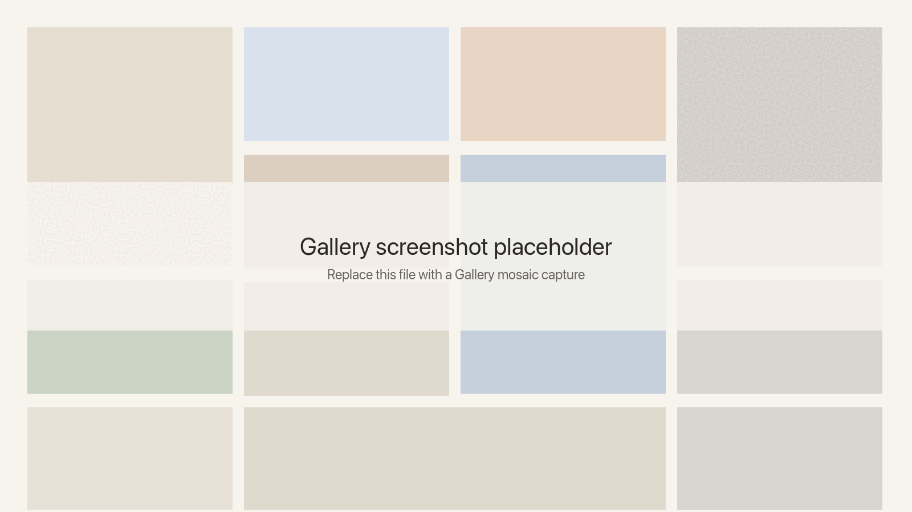
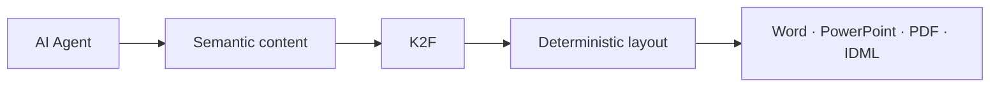

<p align="center">
  <a href="https://k2f.dev">
    
  </a>
</p>

<p align="center">
  <strong>One prompt. Finished Word, PowerPoint, Fillable PDF, and IDML.</strong>
  <br />
  Give your AI agent the content. K2F turns it into a polished document.
  <br />
  <em>Consistent like PDF. Editable like code.</em>
</p>

<p align="center">
  <a href="https://github.com/suzheng/k2f/actions/workflows/golden-suite.yml"></a>
  <a href="https://crates.io/crates/k2f"></a>
  <a href="https://pypi.org/project/k2f/"></a>
  <a href="https://www.npmjs.com/package/@openk2f/k2f"></a>
  <a href="LICENSE"></a>
</p>

<p align="center">
  <a href="https://k2f.dev"><b>k2f.dev</b></a> ·
  <a href="https://k2f.dev/playground">Playground</a> ·
  <a href="https://k2f.dev/gallery">Gallery</a> ·
  <a href="https://k2f.dev/docs">Docs</a> ·
  <a href="docs/spec/k2f-v0.3.md">Spec</a>
</p>

```bash
npx skills add suzheng/k2f --skill k2f
```

Then paste into your agent:

```
Use the K2F skill to create a [describe what you want]. Install with npx skills add suzheng/k2f --skill k2f if needed.
```

Works with Cursor, Claude Code, Codex, Workbuddy, Manus, OpenClaw, and any agent with `npx skills` support.

## Contents

- [What is K2F](#what-is-k2f)
- [Gallery](#gallery)
- [Export](#export)
- [Why agents](#why-agents)
- [File format](#file-format)
- [Get started](#get-started)
- [Tooling](#tooling)
- [Docs](#docs)
- [Status](#status)

## What is K2F

K2F is an open document format — like PDF or DOCX — that AI can design and edit, and that exports to Word, PowerPoint, Fillable PDF, and IDML.

Your agent writes semantic JSON. The engine compiles a locked layout. You ship a `.K2F` file and the format you need.

A `.K2F` file is a ZIP: editable JSON plus a compiled page. Official readers paint that compiled page; they do not reflow the body. PDF is a locked drawing, so an agent cannot safely rewrite “clause 4.” K2F is a semantic tree *and* a locked page. Longer comparison: [Why K2F](https://k2f.dev/why).

<p align="center">
  <a href="https://k2f.dev/gallery/aurora-data">
    
  </a>
  <br />
  <em>Example K2F file — the Aurora Data gallery template. Try it in the <a href="https://k2f.dev/playground">Playground</a>.</em>
</p>

## Gallery

Free templates. No account, no watermarks, no limits. Every template is editable K2F and exportable to Word, PowerPoint, and IDML.

Reports, presentations, posters, CVs, forms, invoices, planners, and more.

<p align="center">
  <a href="https://k2f.dev/gallery">
    
  </a>
  <br />
  <em>Browse the <a href="https://k2f.dev/gallery">Gallery</a>.</em>
</p>

## Export

Generate a document from your agent, then ship Word, PowerPoint, fillable PDF, or InDesign. Available in Playground, Desktop Reader, and CLI.

- **Word** — Fully editable DOCX, ready for review and collaboration
- **PowerPoint** — Pixel-perfect slides with zero shifted elements
- **Fillable PDF** — Interactive AcroForm documents, built automatically
- **IDML** — Professional InDesign files for design workflows
- **Markdown & images** — Text round-trip and high-fidelity PNG renders

```bash
k2f export-pdf  doc.K2F -o doc.pdf
k2f export-pptx doc.K2F -o doc.pptx
k2f export-docx doc.K2F -o doc.docx
k2f export-idml doc.K2F -o doc
```

`.K2F` stays the source. Exports are drawings of the published lock (`PDF_IS_NOT_A_SOURCE`, same for PPTX, DOCX, and IDML).

Default `export-pdf` writes AcroForm widgets for `form_field` nodes; `--flatten` paints glyphs instead. Fillable widgets are PDF-only — Word and PowerPoint export those fields as drawn boxes. IDML export writes an InDesign package: the `.idml` beside `Document Fonts/`.

Guides: [Export](docs/guide/exporting.md) · [PDF](docs/guide/exporting-pdf.md) · [PowerPoint](docs/guide/exporting-pptx.md) · [Word](docs/guide/exporting-docx.md) · [InDesign](docs/guide/exporting-idml.md)

## Why agents

Restyle with a sentence. Fix without breaking layouts.

- **Zero-friction editing.** DOCX and PDF are hard for AI to manipulate safely. K2F separates content from styles, so agents can rewrite or restyle without breaking the layout.
- **Semantic-first restyling.** Ask for a dark corporate palette and bolder headings. K2F recompiles the theme without shifting the layout.
- **Native AcroForm.** Agents can detect fields like Signature, Applicant Name, and Date, then generate precisely positioned interactive PDF fields.
- **Deterministic rollback.** Every document is a semantic tree. Patch or revert one node without touching the rest.



## File format

Two parts you edit: content and theme. The engine handles layout.

- The content describes **what** the document means.
- The theme describes **how** it looks.
- The engine determines **how** it is laid out.

```
document.k2f
├── manifest.json          # metadata
├── content/root.json      # semantic content tree
├── styles/theme.json      # theme styles
└── document.K2F.lock      # render lock (generated after compile)
```

```json
{
  "id": "invoice.header",
  "role": "h1",
  "content": { "type": "text", "value": "STATEMENT #2025-001" }
}
```

```json
{
  "roles": {
    "h1": { "font_size": 24000, "bold": true, "color": "google_blue_600" },
    "body": { "font_size": 12000, "color": "ink" }
  },
  "palette": {
    "ink": "#202124",
    "google_blue_600": "#1A73E8"
  }
}
```

Every node has a stable dotted `id` such as `invoice.total`. Coordinates and colors stay out of the content tree. Fonts and images travel in the same ZIP. See the [format spec](docs/spec/k2f-v0.3.md).

## Get started

### Use an agent

```bash
npx skills add suzheng/k2f --skill k2f
pip install k2f
```

Then paste *Use the K2F skill to create a [describe what you want]…* `pip install k2f` puts the CLI on PATH; the skill scripts call it.

If `npx skills` is not available, copy [`skills/k2f/`](skills/k2f/) into your agent's skills directory (for example `~/.cursor/skills/k2f/`), or browse [skills/k2f on GitHub](https://github.com/suzheng/k2f/tree/main/skills/k2f).

MCP is optional. A local stdio server is shipped ([`engine/k2f_mcp`](engine/k2f_mcp/README.md)); remote HTTP MCP is not.

Workflows: [skills/README.md](skills/README.md) · [skills/k2f/SKILL.md](skills/k2f/SKILL.md).

### Use the CLI

```bash
pip install k2f
```

Python 3.9+. This installs the `k2f` CLI and the Python SDK. Optional: `cargo install k2f` for a CLI without Python. Install `@openk2f/k2f` only when you embed the [web viewer](docs/guide/web-viewer.md).

First packed file (`init_package.py`, `pack_verify.py`): [Getting started](docs/guide/getting-started.md). Then export as in [Export](#export).

SDKs: [Python](sdk/python/README.md) · [JavaScript](sdk/js/README.md) · [Rust](engine/k2f_sdk/README.md) · [CLI](cli/k2f_cli/README.md)

## Tooling

- [Playground](https://k2f.dev/playground) — edit and preview `.K2F` in the browser
- [Desktop Reader](https://k2f.dev/download) — open and verify files offline. Packaged builds are on the site; the source crate is still in development ([`desktop/k2f_reader`](desktop/k2f_reader/README.md))
- [Web viewer](docs/guide/web-viewer.md) — embed `<k2f-viewer>` (`npm i @openk2f/k2f`)
- [Docs](https://k2f.dev/docs) — format spec, authoring, and export ([`docs/`](docs/README.md))

## Docs

**Get started**

- [Introduction](docs/README.md)
- [Getting started](docs/guide/getting-started.md)

**Export**

- [Overview](docs/guide/exporting.md)
- [PDF](docs/guide/exporting-pdf.md)
- [PowerPoint](docs/guide/exporting-pptx.md)
- [Word](docs/guide/exporting-docx.md)
- [InDesign](docs/guide/exporting-idml.md)

**Authoring**

- [Text](docs/authoring/text.md)
- [Images](docs/authoring/images.md)
- [Tables](docs/authoring/tables.md)
- [Layout](docs/authoring/layout.md)
- [Theme and fonts](docs/authoring/theme.md)

**Reference**

- [Catalog](docs/reference/catalog.md)
- [Allowed keys](docs/reference/keys.md)
- [Format Spec v0.3](docs/spec/k2f-v0.3.md)

**Guides**

- [Markdown conversion](docs/guide/markdown.md)
- [Web viewer](docs/guide/web-viewer.md)

**Tools**

- [Agent skill](skills/k2f/SKILL.md)
- [Python SDK](sdk/python/README.md)
- [JavaScript SDK](sdk/js/README.md)
- [CLI](cli/k2f_cli/README.md)
- [Security](SECURITY.md)
- [Contributing](CONTRIBUTING.md)

## Status

Format spec **v0.3** is the on-disk contract, aligned with SDK **0.3.x**. Packaged desktop builds are on [k2f.dev/download](https://k2f.dev/download); OS code signing is still roadmap. Remote HTTP MCP is not shipped (stdio is). Full list: [status](docs/guide/status.md).

Licensed under **Apache-2.0**. See [LICENSE](LICENSE).
