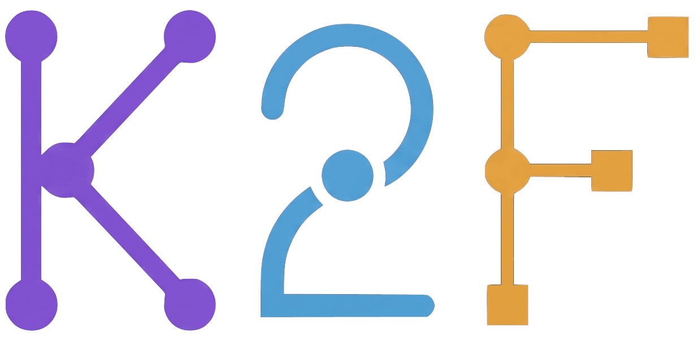
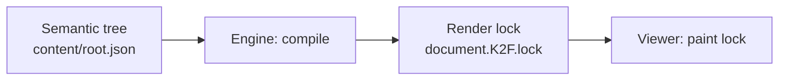

<p align="center">
  <a href="https://k2f.dev">
    
  </a>
</p>

<p align="center">
  <strong>The PDF format for the AI agent era.</strong>
  <br />
  Consistent like PDF. Editable like code.
</p>

<p align="center">
  <a href="https://github.com/suzheng/k2f/actions/workflows/golden-suite.yml"></a>
  <a href="https://crates.io/crates/k2f"></a>
  <a href="https://pypi.org/project/k2f/"></a>
  <a href="https://www.npmjs.com/package/@openk2f/k2f"></a>
</p>

<p align="center">
  <a href="https://k2f.dev"><b>k2f.dev</b></a> ·
  <a href="https://k2f.dev/playground">Playground</a> ·
  <a href="https://k2f.dev/gallery">Gallery</a> ·
  <a href="https://k2f.dev/docs">Docs</a> ·
  <a href="docs/spec/k2f-v0.1.md">Spec</a>
</p>

---

K2F is a packaged document format (`.K2F`) built for AI agents and deterministic readers. Agents edit a **semantic tree**; the reference engine compiles a **render lock** that paints identically on every official reader.

## The problem

PDF is a black box for AI — hard to read, impossible to edit. HTML is a sandcastle for AI — every render differs, styles drift. AI needs a format that is natively editable and renders with absolute certainty.

| Format | Reality |
|--------|---------|
| **PDF** | Unreadable · Uneditable |
| **HTML** | Render drift · Style chaos |
| **K2F** | Editable semantics · Locked rendering |

## Get started

### A. Agent Skill

Install the skill into Cursor, Claude Code, Codex, or any agent that supports `npx skills`:

```bash
npx skills add suzheng/k2f --skill k2f
```

**Manual fallback:** copy [`skills/k2f/`](skills/k2f/) into your agent's skills directory (e.g. `~/.cursor/skills/k2f/`), or browse [skills/k2f on GitHub](https://github.com/suzheng/k2f/tree/main/skills/k2f).

Then say: *"Generate an invoice"* or *"Write a monthly report."*

### B. SDK / CLI — for developers

```bash
pip install k2f              # CLI on PATH + Python SDK
npm i @openk2f/k2f           # JS / WASM SDK + <k2f-viewer>
# cargo install k2f          # optional: CLI without Python
```

```python
import json
import k2f

ed = k2f.Editor.open_template("invoice")
ed.insert_node("root", 0, json.dumps({
    "id": "invoice.title",
    "role": "h1",
    "content": {"type": "text", "value": "Invoice #1042"},
}))
ed.insert_node("root", 1, json.dumps({
    "id": "invoice.body",
    "role": "body",
    "content": {"type": "text", "value": "Payment due in 30 days."},
}))
ed.validate_package()
bytes(ed.save_bytes())
```

JavaScript / WASM: see [`sdk/js/README.md`](sdk/js/README.md) (`initWasm` required).

```bash
k2f markdown notes.md -o notes.K2F --theme report
```

Build from source, smoke tests, and troubleshooting: [Getting Started](docs/guide/getting-started.md) · [Contributing](CONTRIBUTING.md).

### C. Browser — no install

Try documents in the [Playground](https://k2f.dev/playground) or browse official samples in the [Gallery](https://k2f.dev/gallery).

## Why K2F is different

| Capability | Detail |
|------------|--------|
| **AI-native read & write** | JSON semantic tree with stable dotted node ids — agents patch by id, not by coordinate |
| **Deterministic rendering** | Same package + pinned engine version → pixel-identical output (embedded fonts only; no system fonts) |
| **Semantically editable** | Edit meaning and roles, not x/y and colors — all appearance lives in the theme |
| **Precise rollback** | Content is a tree with `changelog.json` — revert any node without touching the rest |
| **Self-contained file** | Fonts, images, and data packaged into one `.K2F` ZIP — send it and it's complete |
| **Open and it's done** | Viewers execute `document.K2F.lock` only — no re-layout, no drift |



The **semantic tree** is what agents read and write. The **render lock** is compiled geometry and paint ops — immutable until content or theme changes. Official viewers paint the lock; they do not re-layout body text.

## How a file is structured

At its core, two parts: **content** and **theme**. The engine handles layout automatically.

**Content** (`content/root.json`) — excerpt:

```json
{
  "id": "invoice.header",
  "role": "h1",
  "content": { "type": "text", "value": "STATEMENT #2025-001" }
},
{
  "id": "invoice.details",
  "role": "body",
  "content": { "type": "text", "value": "Date: 15 Dec 2025\nBill To: TechInnovate Inc." }
},
{
  "role": "warning",
  "content": { "type": "text", "value": "Semantics and styles are fully separated." }
}
```

**Theme** (`styles/theme.json`) — excerpt:

```json
{
  "roles": {
    "h1": { "font_size": 24000, "bold": true, "color": "google_blue_600" },
    "body": { "font_size": 12000, "color": "ink" }
  },
  "palette": {
    "ink": "#202124",
    "google_blue_600": "#1A73E8"
  }
}
```

**Package layout:**

```
document.k2f
├── manifest.json       # metadata
├── content/root.json   # semantic content tree
├── styles/theme.json   # theme styles
└── document.K2F.lock   # render lock (generated after compile)
```

Full container also includes embedded fonts, embedded schemas, and `changelog.json`. See [Format spec v0.1](docs/spec/k2f-v0.1.md).

## What's shipped (v0.1)

| Shipped | Not shipped |
|---------|-------------|
| `.K2F` package format (ZIP + semantic tree + theme + lock) | Desktop installer (source crate only — [desktop reader (in development)](desktop/k2f_reader/README.md)) |
| Web viewer (`<k2f-viewer>`) | Remote HTTP MCP (stdio MCP is shipped) |
| Python SDK (`pip install k2f`) | Slide / infinite canvas modes |
| JS / WASM SDK (`npm i @openk2f/k2f`) | PDF import (`PDF_IS_NOT_A_SOURCE`) |
| CLI (`cargo install k2f`) | |
| One agent skill (`skills/k2f/`) | |
| MCP stdio server | |
| Markdown ↔ K2F bridge | |
| Native math (TeX subset) | |
| Verify, integrity banners, Ed25519 sign | |

Full status and roadmap: [docs/guide/status.md](docs/guide/status.md).

## Documentation & tooling

| Resource | Link |
|----------|------|
| Live Playground | [k2f.dev/playground](https://k2f.dev/playground) |
| Gallery | [k2f.dev/gallery](https://k2f.dev/gallery) |
| Documentation | [k2f.dev/docs](https://k2f.dev/docs) · [docs/](docs/README.md) |
| Format spec | [docs/spec/k2f-v0.1.md](docs/spec/k2f-v0.1.md) |
| Design goals | [docs/architecture/design.md](docs/architecture/design.md) |
| Codebase map | [docs/architecture/codebase.md](docs/architecture/codebase.md) |
| Agent skills | [skills/k2f/](skills/k2f/SKILL.md) |
| MCP stdio server | [engine/k2f_mcp/README.md](engine/k2f_mcp/README.md) |
| Python SDK | [sdk/python/README.md](sdk/python/README.md) |
| JavaScript SDK | [sdk/js/README.md](sdk/js/README.md) |
| CLI | [cli/k2f_cli/README.md](cli/k2f_cli/README.md) |
| Security | [SECURITY.md](SECURITY.md) |
| Contributing | [CONTRIBUTING.md](CONTRIBUTING.md) |

Licensed under **Apache-2.0**. See [LICENSE](LICENSE).
