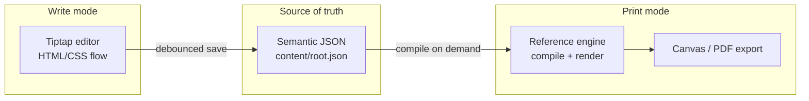

# Human editor architecture (design proposal)

Candidate architecture for a future web-native writing UI. This is **not** the shipped editing surface in v0.1.

**Status:** Design proposal (not implemented)  
**Contract:** [k2f-v0.1.md](../spec/k2f-v0.1.md) · **Roadmap:** [status.md](../guide/status.md)

## What ships today

v0.1 edits the semantic tree through:

- SDK `Editor` API — [`engine/k2f_sdk/src/editor/mod.rs`](../../engine/k2f_sdk/src/editor/mod.rs)
- CLI — edit by stable node id, then relock

There is no Tiptap/React writing UI. Agents and developers patch `content/root.json` surgically; the engine recompiles `document.K2F.lock`.

This document describes a **future** human-facing editor that separates drafting from publishing.

## Core philosophy

**Draft in flow, publish in stone.**

| Mode | Purpose | Technology |
|------|---------|------------|
| **Write mode** | Fluid content creation, AI collaboration, IME-friendly typing | Browser HTML (e.g. Tiptap / ProseMirror) |
| **Print mode** | Deterministic archival layout | Reference engine (`k2f_layout` → `document.K2F.lock`) |

Browsers excel at text input. The reference engine excels at deterministic archival rendering. The proposal aligns each platform with its strength: **HTML for editing, WASM for publishing.**

**Important:** Tiptap/ProseMirror JSON is not State A. A future editor needs an explicit mapping layer from rich-text document JSON → `content/root.json` semantic nodes.

## Component diagram



## Dual-mode workflow

Writing and final formatting are different mindsets. Do not try to make the HTML editor pixel-match the final document (WYSIWYG). That fight is unwinnable and undermines determinism.

### Write mode (draft / galley view)

- **Technology:** React + Tiptap or ProseMirror (headless rich-text)
- **Layout:** standard CSS flow (continuous scroll, fluid width)
- **Input:** native `contenteditable`
- **Behavior:** continuous scroll; no page breaks; uses theme fonts and colors ("vibe") but does not emulate exact margins or pagination

**Advantages:**

- IME support (Chinese, Japanese, Korean)
- Native spellcheck and accessibility
- Low-latency typing
- Browsers handle edge cases: emojis, mobile keyboards, selection handles, paste from Word

### Print mode (page view / export)

- **Trigger:** user switches to "Page view" or exports
- **Process:** reference engine takes semantic JSON, applies theme and layout rules
- **Output:** `document.K2F.lock` rendered to `<canvas>` or PDF
- **Guarantee:** recipient sees exactly what the engine compiled

### Proof loop (expectation management)

Run the compile engine in a Web Worker. As the user types, the worker calculates approximate page breaks in the background. Draw dashed "page break indicators" in the draft editor where breaks will likely fall. This sets expectations without requiring pixel-perfect CSS ↔ Rust parity.

## Ghost layer (AI suggestions)

AI decorations are **ephemeral**—they exist in the view, not the document model.

- AI can overlay ghost text or diff highlights
- If the user rejects a suggestion, it vanishes without touching `content/root.json`
- State A (semantic tree) stays pure

**Example flow:**

1. User selects text → "Make it friendlier"
2. AI returns new text
3. Editor shows a dashed-border suggestion inline
4. Accept → patch semantic JSON; Reject → decoration removed

No geometry recalculation is needed in draft mode because HTML flow expands vertically.

## Tech stack

| Layer | Choice | Notes |
|-------|--------|-------|
| Editor core | React + Tiptap | Battle-tested; outputs JSON mappable to K2F schema |
| Publisher | Rust (`k2f_layout`, `k2f_text`) | Existing engine; no second shaping or flexbox solver |
| Data | `content/root.json` inside `.K2F` ZIP | Never save HTML as source of truth |

`k2f_sdk::Editor` (shipped) is the print-mode subset: surgical edits + relock. A full human editor would wrap the same compile path.

## Data flow

### A. Editing loop

1. User types in Tiptap
2. Browser renders immediately via HTML/CSS
3. Debounced save writes semantic JSON (local storage or server)—not HTML

```json
{ "type": "paragraph", "content": [{ "type": "text", "text": "Hello World" }] }
```

### B. Publishing loop

1. User switches to page view or saves the file
2. App passes semantic JSON to WASM worker
3. Engine: normalize → shape text → paginate → generate lock
4. Canvas overlays show exact compiled output

## Feature sketches

### Vibe switcher

- **Draft mode:** CSS variables (`--font-family`, `--bg-color`) for instant theme preview
- **Print mode:** engine loads `theme.json` and recalculates geometry (e.g. wider margins in "Modern Tech")

### Collaboration (section locking)

- User A locks a paragraph by section ID
- User B sees that block as read-only
- Avoids character-level CRDT complexity; block-level locking is sufficient for many document workflows

## Why draft and print are separate

| Concern | Draft mode (browser) | Print mode (engine) |
|---------|---------------------|---------------------|
| Text input | Native, 60fps, IME-safe | Not used for typing |
| Layout | Approximate flow | Exact, deterministic |
| Compile cost | None during typing | On demand (page view, export) |
| Archival promise | — | `document.K2F.lock` frozen forever |

A human editor built on off-the-shelf React libraries can ship faster than writing a text engine from scratch—while still delivering K2F's core promise: deterministic archival via the reference engine.

The `document.K2F.lock` file remains generated by the same rigorous compile path used today, ensuring the file opens identically decades later.

## Related documents

- [design.md](design.md) — why semantic intent and deterministic geometry are separated
- [codebase.md](codebase.md) — `k2f_sdk::Editor` and compile entry points
- [layout-engine.md](layout-engine.md) — what happens during compile
