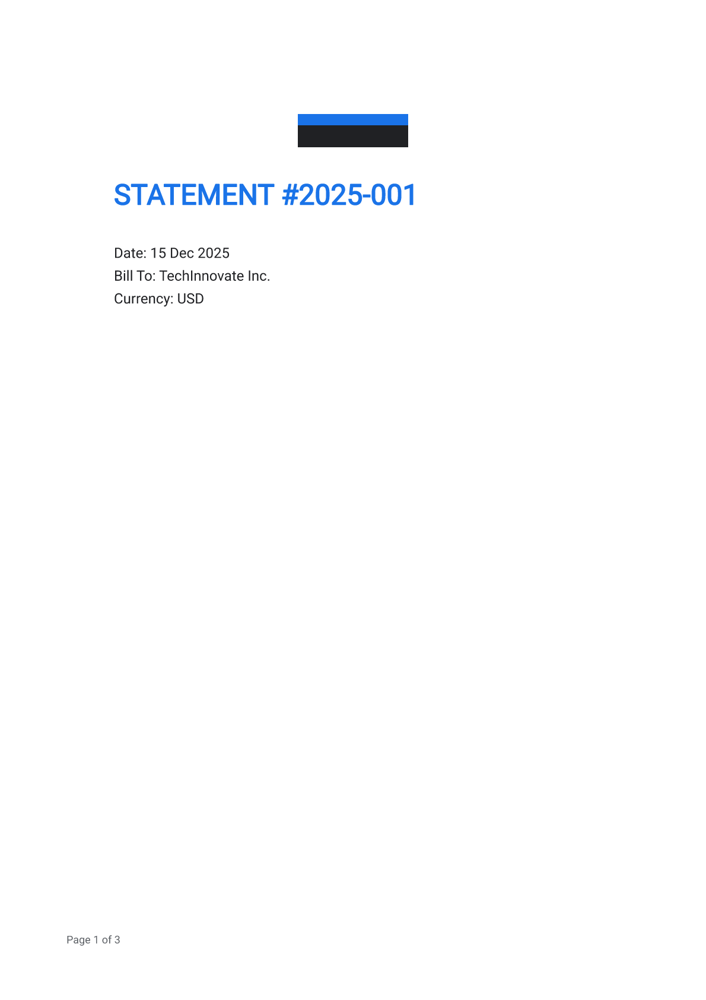

# Getting Started

Install the K2F toolchain and produce your first `.K2F` package.

## Use published packages

No repository clone required.

### Prerequisites

- **Python 3.9+** — for `pip install k2f` (CLI + SDK on PATH)
- **Node.js 18+** — for `npm i @openk2f/k2f` (browser tooling)
- **Rust** (latest stable) — only for building from source or `cargo install k2f`

### Install

```bash
pip install k2f
npm i @openk2f/k2f
# cargo install k2f   # optional: CLI without Python
```

### Minimal Python example

```python
import json
import k2f

ed = k2f.Editor.open_dir("./source")  # from init_package.py or k2f unpack
ed.insert_node("root", 0, json.dumps({
    "id": "root.title",
    "role": "h1",
    "content": {"type": "text", "value": "Hello K2F"},
}))
ed.insert_node("root", 1, json.dumps({
    "id": "root.body",
    "role": "body",
    "content": {"type": "text", "value": "First paragraph."},
}))
ed.validate_package()
open("/tmp/hello.K2F", "wb").write(ed.save_bytes())
```

Or open a packed file:

```python
import k2f

ed = k2f.Editor.open_bytes(open("hello.K2F", "rb").read())
ed.replace_text("root.title", "Hello K2F")
```

### Verify

```bash
k2f verify /tmp/hello.K2F
```

Expect banner `UNSIGNED` or `VALID` on a freshly saved package.

### Open in a browser

Serve any directory over **HTTP** (WASM does not load from `file://`). Download a `.K2F`, then embed with the [web viewer](web-viewer.md) or open the [web embed example](../../examples/web-embed/README.md) from a full repo checkout.

## Build from this repository

For contributors, golden tests, and the smoke script.

### Prerequisites

- **Rust** (latest stable) — [rustup.rs](https://rustup.rs/)
- **Python 3.9+**
- **maturin** — installed by `dev-install.sh`
- **wasm-pack** or **wasm-bindgen-cli** — for the JS/WASM SDK (`dev-install.sh` uses `build-sdk-js.sh`, which supports either)

On Windows, run the bash scripts below in **Git Bash** or **WSL**.

### Install

```bash
git clone https://github.com/suzheng/k2f.git
cd k2f
bash scripts/dev-install.sh
```

`dev-install.sh` creates a Python venv under `sdk/python/.venv`, builds the `k2f` Python package with maturin, and compiles the JS WASM bindings.

### Smoke test

```bash
bash scripts/test-getting-started.sh
```

This script:

1. Builds a statement document from `examples/invoice/assets/data/invoice_data.json`
2. Writes `/tmp/k2f-getting-started.K2F` and exports a PDF
3. Confirms PDF cannot be opened as K2F (`PDF_IS_NOT_A_SOURCE`)
4. Runs `k2f verify` (expect `UNSIGNED` or `VALID`)

### Open a document

**Web viewer** — serve the repo over HTTP:

```bash
# Official viewer
cd viewer && python3 -m http.server 8080

# Web embed example
cd examples/web-embed && python3 -m http.server 8081
```

Then open the served URL in a browser.



**Native reader** ([k2f_reader](../../desktop/k2f_reader/README.md)) — same lock-executor rules as the web viewer. Packaged builds: website `/download`. Build from source:

```bash
cargo run -p k2f_reader -- examples/published/invoice.K2F
```

## Next steps

- [Format specification](../spec/k2f-v0.1.md)
- [Official templates](themes.md)
- [Web viewer](web-viewer.md)
- [Project status](status.md)
- [Agent skills](../../skills/README.md)
- [Contributing](../../CONTRIBUTING.md)
